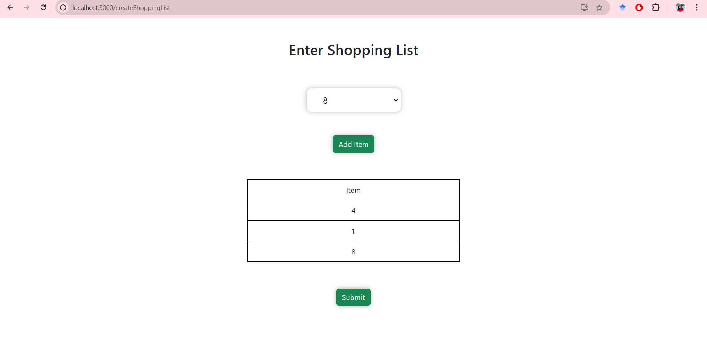
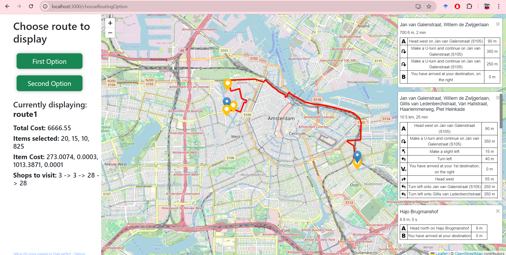

This project is a web prototype for the [Personal Shopper problem](https://arxiv.org/pdf/2008.11705.pdf), which introduces two algorithms to find both optimal and sub-optimal linear skyline routes from the shopper's location to the customer's location and output potential routes that satisfy the time and cost constraints of a personal shopper. The shopper and customer can choose their locations with two clicks respectively, the third click will reset the locations, and we can select the shopper and customer location again. After that, we can add items to the shopping list that the customer wants. This information is sent to the backend, where routes are calculated, and the routing information is shown on the frontend using Leaflet Routing Machine.

## Instructions for running the project
1. Change directory to the `backend` folder first.
2. Inside this folder run `python server.py` from the command line to start the backend server.
3. Change directory to the `frontend` folder.
4. Inside this folder run `npm start` from the command line to run the application in the browser.

## Demo of the project

### Step 1: Selecting shopper and customer locations

### Step 2: Selecting items needed by the customer

### Step 3: Showing both optimal and sub-optimal linear skyline routes

